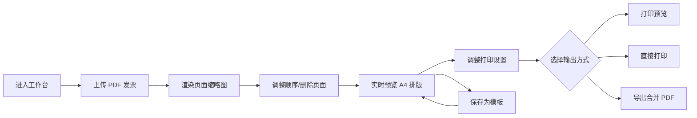

# 发票打印助手 - 产品需求文档（PRD）

## 1. 产品概述

发票打印助手是一款面向财务、行政及个体经营者的轻量级 Web 应用，解决电子发票（PDF）单张打印浪费纸张、排版繁琐的痛点。用户上传 PDF 发票文件后，应用自动将发票页面渲染并排版到 A4 纵向纸张上（每页两张发票），支持实时预览、直接打印和导出为新的合并 PDF。

目标：将 PDF 发票打印从逐张打印的浪费操作转变为高效、省纸、可复用的自助流程。

## 2. 核心功能

### 2.1 用户角色

| 角色 | 使用方式 | 核心权限 |
|------|----------|----------|
| 普通用户 | 本地浏览器直接使用 | 上传 PDF 发票、预览排版、打印、导出合并 PDF、管理常用模板 |

### 2.2 功能模块

1. **发票工作台**：左侧为已上传 PDF 发票列表与缩略图，右侧为打印设置与操作区，中部为 A4 实时预览画布。
2. **PDF 上传管理**：支持拖拽或点击上传 PDF 文件；自动提取所有页面并渲染为缩略图；支持删除、排序、清空。
3. **实时预览区域**：按 A4 纵向 1:1 比例渲染打印效果，默认每页两张发票，支持缩放查看与翻页。
4. **打印设置区域**：调整纸张大小、页边距、纸张方向、发票间距、是否显示裁剪线等。
5. **历史记录 / 模板管理**：保存当前排版为模板，从模板快速加载，查看最近打印/导出历史。

### 2.3 页面详情

| 页面 | 模块 | 功能描述 |
|------|------|----------|
| 工作台 | 发票文件列表 | 显示已上传 PDF 的所有页面缩略图，支持删除、排序、切换选中 |
| 工作台 | 上传区域 | 拖拽/点击上传 PDF，多文件支持，显示上传进度与文件信息 |
| 工作台 | 打印预览 | A4 画布，按设置渲染两张发票页面，支持分页、缩放、全屏预览 |
| 工作台 | 打印设置 | 纸张、边距、方向、裁剪线、缩放比例 |
| 工作台 | 模板面板 | 保存/加载排版模板，展示历史记录与模板卡片 |

## 3. 核心流程

用户进入工作台后，通过上传区域添加 PDF 发票文件。应用使用 pdf.js 将每一页 PDF 渲染为图片，并按 A4 纵向每页两张的规则自动分页。用户可在左侧列表调整顺序或删除不需要的页面，在右侧调整打印设置。确认无误后，可选择“打印预览”调用浏览器打印，或“导出 PDF”生成合并后的 A4 PDF 文件。常用排版可保存为模板，下次直接加载复用。

## 4. 用户界面设计

### 4.1 设计风格

- **整体调性**：专业、克制、可信赖的财务工具感，兼具现代 Web 应用的清晰与呼吸感。
- **主色调**：以 `slate` 中性灰为基底（#0f172a / #334155 / #f8fafc），强调色选用稳重的靛蓝 `indigo`（#4f46e5）与暖琥珀 `amber`（#f59e0b）作为操作高亮。
- **辅色/状态色**：成功 emerald、错误 rose、警告 amber。
- **字体**：界面正文使用 `Noto Sans SC`（清晰易读），数字金额使用 `IBM Plex Mono`（等宽对齐）。
- **按钮样式**：大圆角（rounded-xl）、柔和阴影、hover 时轻微上浮；主要操作使用实心 indigo，次要操作使用浅色背景。
- **布局风格**：三栏响应式布局——左侧文件列表，中部预览画布，右侧设置与操作；移动端自动堆叠为单栏。
- **图标**：使用 lucide-react 线性图标，保持 1.5px 线宽。

### 4.2 页面设计概述

| 页面 | 模块 | UI 元素 |
|------|------|---------|
| 工作台 | 顶部栏 | Logo、应用名称、主操作按钮（打印/导出/预览） |
| 工作台 | 左侧面板 | 上传区域、PDF 页面缩略图列表 |
| 工作台 | 中部预览 | A4 比例画布、缩放控件、翻页、裁剪线虚线 |
| 工作台 | 右侧面板 | 打印设置表单、模板卡片网格、历史记录 |

### 4.3 响应式设计

- **桌面端（≥1280px）**：三栏布局，左侧 360px、右侧 320px，中间预览自适应。
- **平板端（768px–1279px）**：左侧面板变为可折叠抽屉，右侧设置面板同样可收起，预览区占据主空间。
- **移动端（<768px）**：三栏垂直堆叠，预览画布支持手势缩放，设置与列表位于预览上下方。
- 所有交互元素最小触控目标 44×44px。

### 4.4 动效与微交互

- 页面加载：三栏依次淡入上滑（stagger 100ms）。
- 添加/删除发票：列表项使用高度与透明度动画。
- 预览更新：页面内容变化时采用 cross-fade，避免闪烁。
- 按钮 hover：translateY(-1px) + 阴影加深，active 时回弹。
- 保存模板成功：右下角 toast 滑入，2 秒后淡出。

## 5. 数据验证规则

- **文件类型**：仅接受 `application/pdf`。
- **文件大小**：单个文件不超过 20MB。
- **页面数量**：单文件不超过 50 页，总页面数不超过 200 页。
- **页面尺寸**：原始发票页面建议为常见的电子发票尺寸（如宽约 200mm），应用会自动等比缩放适应 A4 内容区。

## 6. 非功能性需求

- **浏览器支持**：Chrome、Edge、Firefox、Safari 最新两个主版本。
- **性能**：首屏加载 <2s，单页 PDF 渲染 <500ms，预览重绘 <200ms。
- **本地化**：简体中文界面与格式。
- **可访问性**：表单标签完整、键盘可导航、主要操作可通过 Enter 触发。
- **数据持久化**：模板与历史记录保存至 localStorage；PDF 文件本身不上传服务器，仅在浏览器内存中处理。
