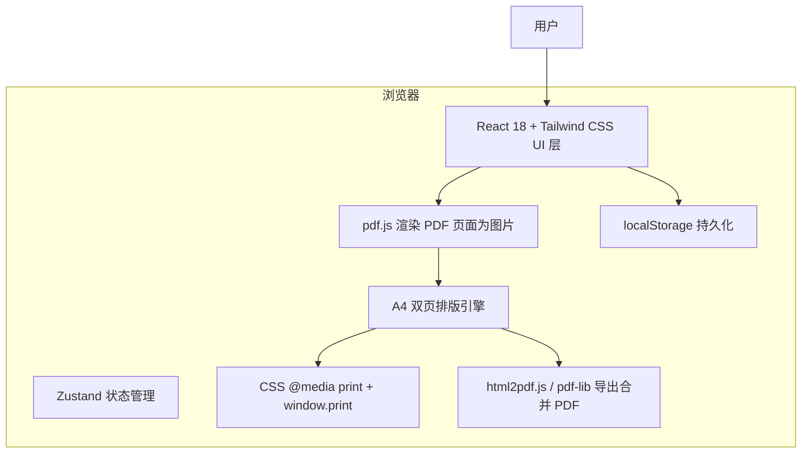

# 发票打印助手 - 技术架构文档

## 1. 架构设计

本项目为纯前端单页应用（SPA），所有 PDF 文件在浏览器本地处理，不上传服务器。应用使用 pdf.js 将 PDF 页面渲染为图片，再按 A4 纵向每页两张的规则排版，提供打印预览与合并 PDF 导出。



## 2. 技术选型

- **前端框架**：React 18（TypeScript）
- **构建工具**：Vite 5
- **样式方案**：Tailwind CSS 3 + 自定义 CSS 变量
- **状态管理**：Zustand
- **图标库**：lucide-react
- **PDF 渲染**：pdfjs-dist（Mozilla PDF.js）
- **PDF 导出**：pdf-lib（将渲染后的页面图片嵌入新的 A4 PDF）
- **打印**：浏览器原生 `window.print()` + `@media print`
- **数据持久化**：localStorage（保存模板与历史记录）

## 3. 路由定义

| 路由 | 用途 |
|------|------|
| `/` | 发票工作台（唯一主页面） |

## 4. 数据模型

### 4.1 实体定义

```typescript
interface PdfPage {
  id: string;
  fileName: string;
  pageNumber: number;
  totalPages: number;
  renderUrl: string;      // canvas 转 data URL
  width: number;          // 原始 PDF 页面宽度（pt）
  height: number;         // 原始 PDF 页面高度（pt）
}

type PaperSize = 'a4' | 'letter';
type Orientation = 'portrait' | 'landscape';

interface PrintSettings {
  paperSize: PaperSize;
  orientation: Orientation;
  marginTop: number;
  marginRight: number;
  marginBottom: number;
  marginLeft: number;
  invoiceGap: number;
  showCutLine: boolean;
  scale: number;
}

interface LayoutTemplate {
  id: string;
  name: string;
  createdAt: number;
  pageIds: string[];       // 保存时各页面的顺序
  settings: PrintSettings;
}

interface HistoryRecord {
  id: string;
  printedAt: number;
  pageCount: number;
  fileNames: string[];
}
```

### 4.2 localStorage 键值

| 键 | 说明 |
|----|------|
| `invoice-print-assistant:pages` | 当前已上传页面 ID 顺序（仅 id 列表，不存图片数据） |
| `invoice-print-assistant:settings` | 打印设置 |
| `invoice-print-assistant:templates` | 已保存排版模板 |
| `invoice-print-assistant:history` | 打印/导出历史记录 |

## 5. 组件结构

```
src/
├── components/
│   ├── AppHeader.tsx          # 顶部应用栏
│   ├── PdfUploader.tsx        # PDF 上传区域（拖拽+点击）
│   ├── PdfPageList.tsx        # PDF 页面缩略图列表
│   ├── PdfPageThumbnail.tsx   # 单个页面缩略图卡片
│   ├── PrintPreview.tsx       # A4 打印预览画布
│   ├── A4Page.tsx             # 单张 A4 页面渲染
│   ├── PrintSettings.tsx      # 打印设置面板
│   ├── TemplatePanel.tsx      # 模板与历史记录面板
│   ├── TemplateCard.tsx       # 模板卡片
│   ├── ActionBar.tsx          # 底部/顶部操作按钮
│   └── PrintStyles.tsx        # @media print 专用样式组件
├── hooks/
│   ├── usePdfPages.ts         # PDF 页面状态与 CRUD
│   ├── usePrintSettings.ts    # 打印设置持久化
│   ├── useTemplates.ts        # 模板持久化
│   ├── useHistory.ts          # 打印历史
│   └── usePdfRenderer.ts      # pdf.js 渲染逻辑
├── utils/
│   ├── pdfRenderer.ts         # pdf.js 封装：file -> canvas -> data URL
│   ├── pdfExporter.ts         # 使用 pdf-lib 生成合并 PDF
│   ├── exportPdf.ts           # html2pdf 备用导出（保留）
│   ├── constants.ts           # 纸张尺寸、默认数据等常量
│   └── validation.ts          # 文件校验
├── stores/
│   └── appStore.ts            # Zustand 全局状态
├── types/
│   └── index.ts               # TypeScript 类型定义
├── pages/
│   └── Workbench.tsx          # 工作台页面
├── App.tsx
└── main.tsx
```

## 6. PDF 渲染策略

### 6.1 渲染流程

1. 用户选择/拖拽 PDF 文件。
2. 使用 `FileReader.readAsArrayBuffer` 读取文件。
3. 调用 `pdfjsLib.getDocument({ data: arrayBuffer })` 加载 PDF。
4. 遍历每一页，使用 `page.render({ canvasContext, viewport })` 渲染到 canvas。
5. 调用 `canvas.toDataURL('image/png')` 获取图片数据 URL。
6. 释放 canvas，保存 `PdfPage` 对象到状态。

### 6.2 性能优化

- 使用 `OffscreenCanvas` 或临时 DOM canvas，渲染完成后立即转换。
- 缩略图使用低分辨率渲染（如 100 DPI），预览与打印使用高分辨率（如 200 DPI）。
- 大文件分批渲染，避免阻塞主线程。

## 7. 打印与 PDF 导出策略

### 7.1 打印预览 / 直接打印

- 使用 `window.print()` 触发浏览器打印对话框。
- 通过 `@media print` 隐藏所有 UI 元素，仅保留 A4 页面内容。
- A4 页面使用固定尺寸 `210mm × 297mm`，内部使用 `` 标签展示渲染后的 PDF 页面。
- 打印时自动分页，每页两张发票（ portrait 模式下纵向排列）。

### 7.2 导出合并 PDF

- 使用 `pdf-lib` 创建新的 A4 PDF 文档。
- 对每一对 PDF 页面，将对应的 PNG 图片嵌入到 A4 页面中的上下两个位置。
- 支持页边距与间距设置，图片按内容区等比缩放。
- 最终保存为新的 PDF 文件。

## 8. 关键算法

### 8.1 分页算法

给定 PDF 页面数组与每页发票数（默认 2），按顺序分组：

```typescript
function paginatePages(pages: PdfPage[], perPage: number): PdfPage[][] {
  const result: PdfPage[][] = [];
  for (let i = 0; i < pages.length; i += perPage) {
    result.push(pages.slice(i, i + perPage));
  }
  return result;
}
```

### 8.2 图片在 A4 内容区中的缩放

```typescript
function fitImageToRect(
  imgWidth: number,
  imgHeight: number,
  rectWidth: number,
  rectHeight: number,
) {
  const scale = Math.min(rectWidth / imgWidth, rectHeight / imgHeight);
  return {
    width: imgWidth * scale,
    height: imgHeight * scale,
  };
}
```

## 9. 开发与构建命令

| 命令 | 说明 |
|------|------|
| `npm install` | 安装依赖 |
| `npm run dev` | 启动开发服务器 |
| `npm run build` | 生产构建 |
| `npm run preview` | 预览生产构建 |
| `npm run check` | TypeScript 类型检查 |

## 10. 风险与限制

- pdf.js 渲染大文件或高分辨率 PDF 时可能消耗较多内存。
- 浏览器打印对话框的边距由用户系统打印机驱动决定，应用内边距设置仅控制内容区。
- pdf-lib 嵌入图片生成的 PDF 文件体积较大，必要时可提供压缩选项。
- localStorage 容量限制约 5MB，模板与历史记录需做数量上限控制；PDF 图片数据不持久化到 localStorage。
